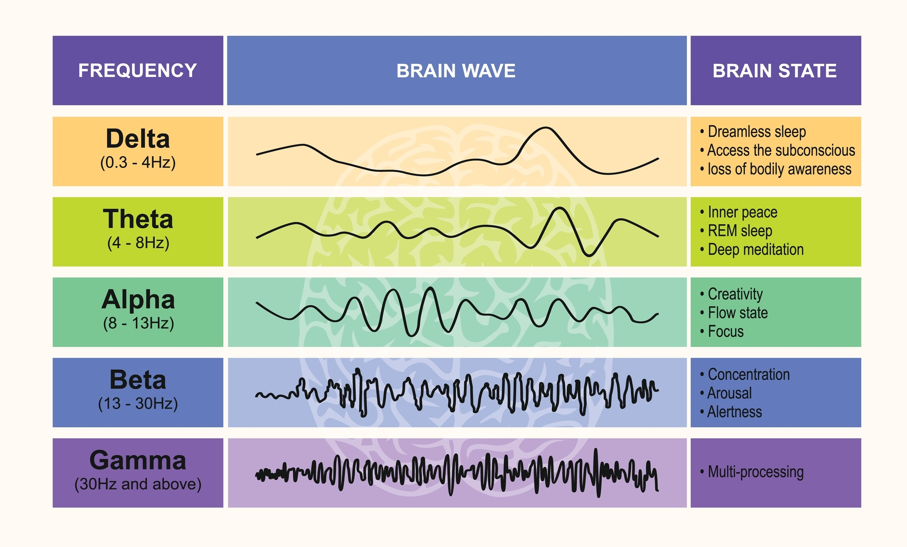

# Binaural

## [▶️ Play](https://nev020.github.io/binauralio/)

---

### I. Clarity

You do not need to work harder. You need to think **clearer**.

This is not software. This is a deliberate state of mind. We have taken decades of neurological science and distilled it into a single, seamless, and inevitable experience.

It begins with silence.

---

### II. Essentialism

Design is not simply how it looks, but how it works.

**Binaural** is powered by the **Web Audio API**. It is live sonic mathematics—pure frequency, generated on demand. We removed everything that did not directly serve the core purpose.

* **The Orb:** Visual feedback. The rhythm of your focus. Nothing else.
* **The Interface:** Play. Pause. Two gestures.

---

### III. Precision

We selected the frequencies because they are true.

The goal is **Brainwave Entrainment**—to guide your electrical activity toward a target state. We target precise neurological bands for precise results.

| Mode | Beat Frequency | State | Rationale |
| :--- | :--- | :--- | :--- |
| **Focus** | **18 Hz** (Beta) | Sustained Cognition | The center of alertness and problem-solving. |
| **Meditate** | **10 Hz** (Alpha) | Creative Flow | Relaxed wakefulness, non-drowsy clarity. |
| **Sleep** | **3 Hz** (Delta) | Deep Restoration | The lowest frequency for healing and sleep. |

The $18 \text{ Hz}$ frequency is not accidental. It is the researched point of optimal sustained attention.

---

### IV. The Human Element

1.  Wear **Headphones**.
2.  Select your intent.
3.  Press Play.

**The most powerful technology is that which disappears entirely.**

**This is Binaural.**
